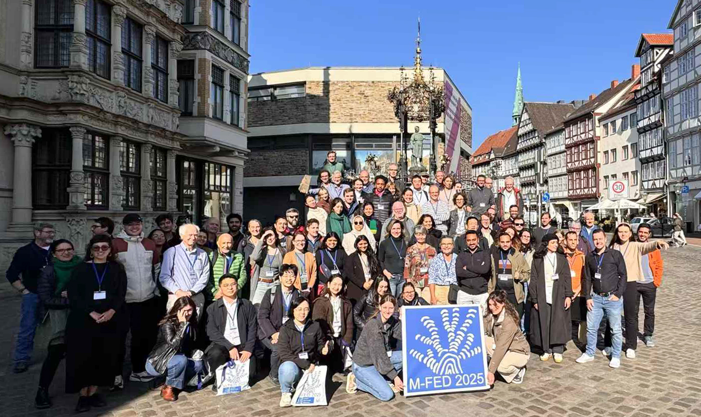

<h1>Welcome!</h1>
<h2>This website is <i>not</i> the entry point for the database</h2>

It <i>is</i> that place to go to find out information about our progress on the project and, eventually, it will be one way to access it.

<h2>NEWS</h2>

  Update on workshops held at the M-FED and Geological Society of America conferences, October, 2025.

Along with Drs. Pierre Sansjofre (Paris Museum of Natural History) and Laurane Fogret (Naturalis Biodiversity Center), Hickson co-led a workshop to get feedback on this project at the Microbialites: Formation, Evolution, Diaganesis (M-FED) meeting. We shared a demo version of the web application, as well as the data entry portal currently configured in MS Access. Approximately 50 attendees participated in this workshop. There was considerable interest and excitement about this project and we got excellent feedback about how to implement the database that we plan on integrating into the user experience. 

Drs. Bartley and Hickson also ran a listening session at the Geological Society of America meeting in San Antonio where we shared a demo of the database. We got quite a bit of feedback on how to make the database useful to researchers and, like the M-FED conference, there was a lot of excitement about the project.

